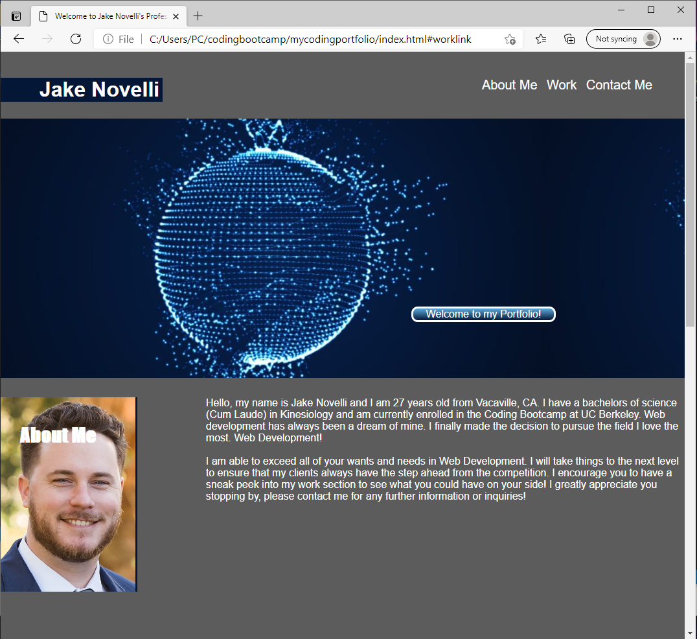
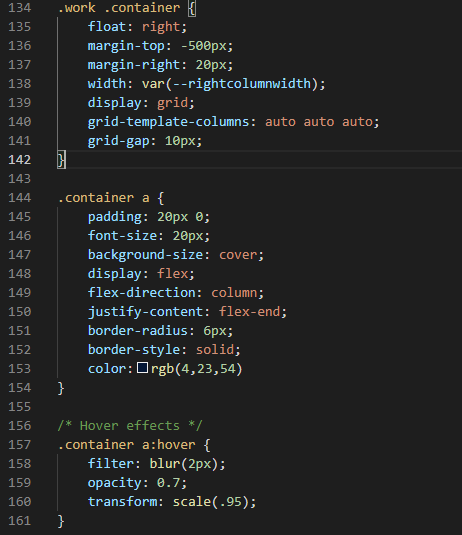

# My Coding Portfolio

## In this project I made a coding portfolio for myself starting from scratch! I had to start by laying out the design of my website so I could have it flow perfectly. I made sure to use semantic elements and make comments on my css so that if anyone else were to work on it, they can understand what's going on in each section. This project was a challenge for me, but through using my resources and trying new things I was able to overcome all obstacles and provide a responsive website that looks great!

## Technology I Put to Work
- GitHub - repository storage for the project in order to amke changes, deploy them and push to a main branch. 

- GitBash - used for written commands and communicating witht he repository stored on GitHub.

- HTML - used to create and edit electronic documents stored on the web.

- CSS - used to edit style and appearance of the website. Which includes:

    - Flexbox - a layout design that can make your website responsive to screen sizes by shrinking and growing.
    - Media Queries - responsive web design that will make layouts appear differently on set screen sizes and resolutions.
    - Display Grid's - grids are used to create a table of items that you can position accordingly.

## Site Preview

## How was it made? Well take a look here!

'''HTML

            <h2>Work</h2>
                <aside class="container">
                    <a class="photo1" target=blank href="#" alt="This will be my surf report link">
                        <figure>
                            <h3>Surf Report</h3>
                            
MERN Stack

                        </figure>
                    </a>
                    <a class="photo2" target=blank href="#" alt="This will be my LED Wall link">    
                        <figure>
                            <h3>LED Wall</h3>
                            
Nodes/ IoT

                        </figure>
                    </a>

'''CSS

## I have the entire website deployed here! Feel free to click and take a look!

[Full-Site](https://dnovelli1.github.io/mycodingportfolio/)

## Links to my other Professional Site's!

[LinkedIn](https://www.linkedin.com/in/david-jacob-novelli/)

[GitHub](https://github.com/dnovelli1)